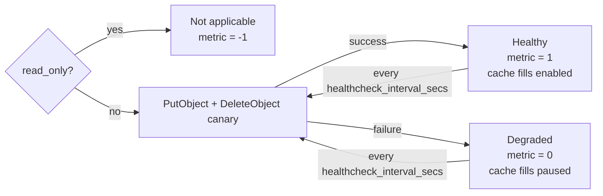

# mirror-intel

The intelligent mirror redirector middleware for SJTUG.

For more information about our mirror service, refer to https://github.com/sjtug/mirror-docker-unified/wiki

## Usage

First of all, put `Rocket.toml` in the same folder as `mirror-intel`. Then,

```sh
RUST_LOG=info ./mirror-intel
```

Or set environment variable `ROCKET_TOML_PATH` to the path of `Rocket.toml`.

```sh
RUST_LOG=info ROCKET_TOML_PATH=Rocket.toml ./mirror-intel
```

For more advanced usage, you may refer to `mirror-intel` service defined in [mirror-docker-siyuan](https://github.com/sjtug/mirror-docker-siyuan).

After starting `mirror-intel`, it will serve on HTTP port 8000. You may set package manager with `localhost:8000` endpoint,
and start testing.

## Supported Repos

See `Rocket.toml`.

## Configuration

Please refer to `Rocket.toml` for more information.

## S3 upload health



When `read_only = false`, mirror-intel requires non-empty `AWS_ACCESS_KEY_ID` and
`AWS_SECRET_ACCESS_KEY` environment variables. It performs an authenticated
`PutObject` canary at startup and then at `healthcheck_interval_secs`, deleting
the canary after each probe. Each PutObject and DeleteObject operation uses
`healthcheck_timeout_secs` as its timeout.

A failed probe changes `s3_put_object_healthy` to `0` and pauses new cache fills
while cache hits and upstream responses continue to be served. A later
successful probe changes the metric to `1` and automatically resumes cache
fills. Read-only instances expose `-1` because authenticated upload health does
not apply. Status transitions and failed canary cleanup attempts are also
logged.

## Detail

* mirror-intel will first query if object exists in s3 backend
* if yes, it will redirect user to s3 object storage
* otherwise, it will redirect user to original site, and submit task for download
* the task will download file from original site and upload it to s3 backend
